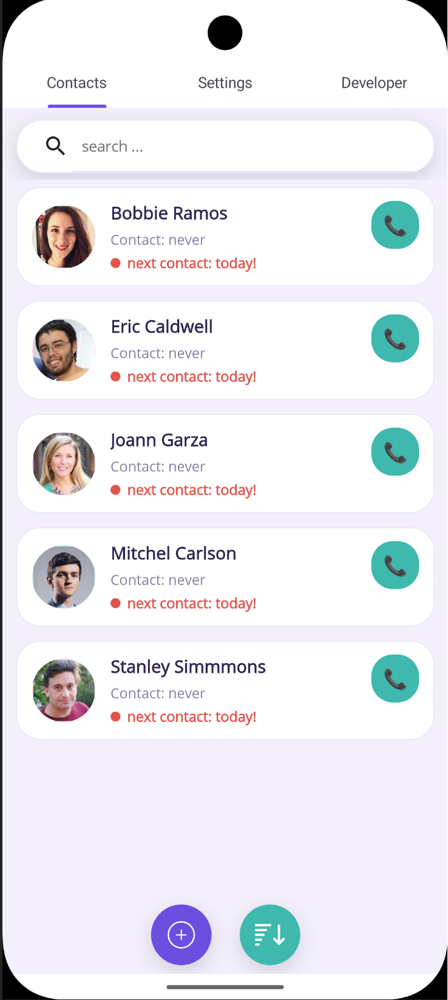
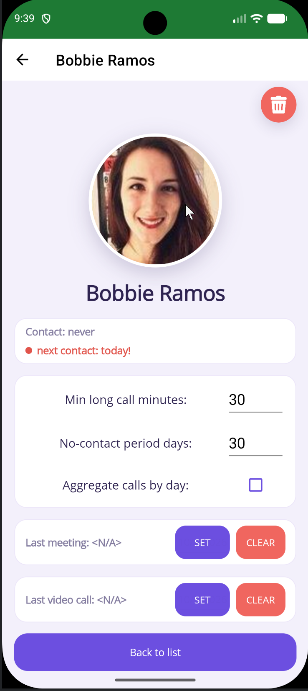
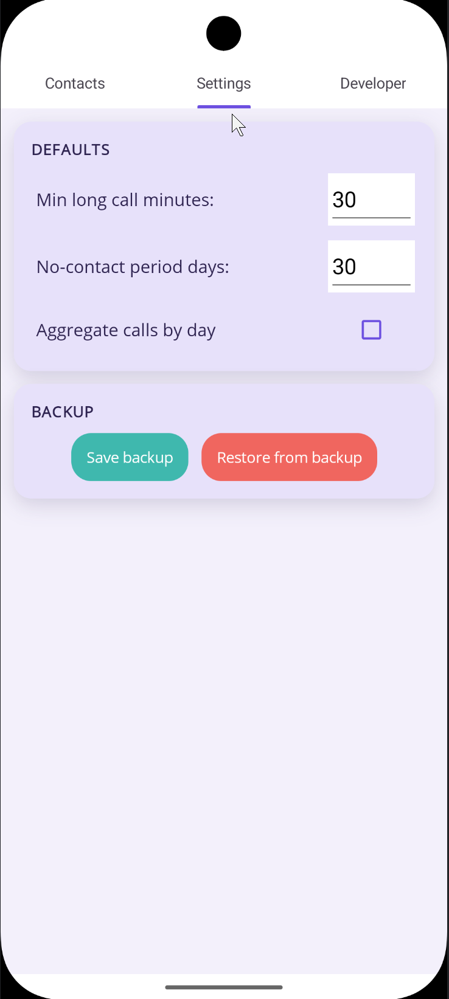

# Relate

> [!WARNING]
> **Personal, experimental project - use at your own risk.**
>
> Relate is built primarily for its author's personal use and is under active development.
> It is an early, rough prototype: the UI is unpolished, features may change or break between
> releases, and stored data formats are not guaranteed to stay compatible.
>
> The app is provided "as is", without warranty of any kind (see the [license](LICENSE)).
> The author accepts no liability for any damage or data loss resulting from its use.
> Keep a backup of anything you care about.

An Android app that helps you keep in touch with the people who matter to you.

## Purpose

It's easy to lose contact with friends and family simply because nobody tracks how long it
has been since the last real conversation. Relate does that for you: for every contact you
choose, you set how often you want to be in touch, and the app shows who you should reach
out to next.

## Features

- Pick people from the phone's contact list and set a **no-contact period** for each of them
  (e.g. "talk at least every 30 days").
- The **last contact** is detected automatically from the phone's call log. Only calls longer
  than a configurable minimum count as a real conversation.
- **Meetings and video calls** can be entered manually, since they don't show up in the call log.
- The contact list shows **when the next contact is due** and highlights overdue ones.
- Call a contact directly from the app.
- **Backup and restore** of your contacts and settings as a JSON file in the public
  `Documents/Relate` (or `Downloads/Relate`) folder, so it survives an app reinstall.

## Screenshots

| Contact list | Contact details | Settings |
|:---:|:---:|:---:|
|  |  |  |
| Who to reach out to next | Per-contact settings, manual meetings and video calls | Defaults and backup |

> The people shown in the screenshots are not real. Their names and photos were generated
> by [randomuser.me](https://randomuser.me/).

## Tech stack

- **.NET 10** / **C#**, **.NET MAUI** (Android is the main target)
- UI written in C# (no XAML) with **CommunityToolkit.Maui.Markup**
- MVVM with **CommunityToolkit.Mvvm**
- **CommunityToolkit.Maui**, **Syncfusion.Maui.Toolkit**
- **OneOf** and **CSharpFunctionalExtensions** for explicit result/error handling
- Native Android APIs (`ContactsContract`, `CallLog`) to read contacts and call history
- Tests: **xUnit v3**, **AwesomeAssertions**, **Moq**

## Repository layout

```
src/Relate.sln       solution
src/Relate/          the MAUI app
src/UnitTests/       unit tests
.github/workflows/   CI/CD pipeline
```

## Building

Requirements: .NET SDK from `src/global.json`, the MAUI Android workload
(`dotnet workload install maui-android`), Android SDK and JDK.

```powershell
# tests
dotnet test src/UnitTests/UnitTests.csproj

# release APK (signed with the local debug key)
dotnet publish src/Relate/Relate.csproj -f net10.0-android -c Release -p:AndroidPackageFormat=apk
```

The APK ends up in `src/Relate/bin/Release/net10.0-android/publish/`.

## Versioning

The app version is `0.0.1-<build>` (the `0.0.1` part is `VersionPrefix` in `Relate.csproj`):

- **CI:** `<build>` is the GitHub Actions run number, e.g. `0.0.1-42`.
- **Local builds:** `<build>` is the UTC build timestamp, e.g. `0.0.1-20261004215530`.

Android's internal `versionCode` is the number of minutes since 2025-01-01 UTC, so every new
build (local or CI) can be installed as an update of the previous one.

## CI/CD

`.github/workflows/ci.yml`:

- **Other branches:** every push runs the unit tests.
- **`main`:** only a push that changes files under `src/` runs the unit tests and, if they
  pass, builds a signed APK and publishes it as a GitHub **pre-release** tagged
  `v0.0.1-<run number>`. A push to `main` that changes only docs, the pipeline or other
  non-code files skips both.
- A manual run (*Run workflow*) on `main` always tests and releases, e.g. after fixing
  the pipeline itself.

### Release signing

Android only installs an update if it's signed with the same key as the installed app, so CI
signs the APK with a keystore stored in GitHub secrets. One-time setup:

```powershell
# 1. Generate the keystore (keytool comes with the JDK). Keep the file and passwords safe
#    and outside of the repository - losing them means users have to reinstall the app.
keytool -genkeypair -v -keystore relate.keystore -alias relate -keyalg RSA -keysize 2048 -validity 10000

# 2. Encode it as base64 to paste into a secret
[Convert]::ToBase64String([IO.File]::ReadAllBytes("relate.keystore")) | Set-Clipboard
```

3. In GitHub: *Settings → Secrets and variables → Actions → New repository secret*, add:

| Secret                      | Value                              |
|-----------------------------|------------------------------------|
| `ANDROID_KEYSTORE_BASE64`   | base64 of the keystore (step 2)    |
| `ANDROID_KEYSTORE_PASSWORD` | keystore password                  |
| `ANDROID_KEY_ALIAS`         | key alias (`relate` above)         |
| `ANDROID_KEY_PASSWORD`      | key password                       |

Without these secrets the release job fails with a message naming the missing secret.

## License

[MIT](LICENSE)
